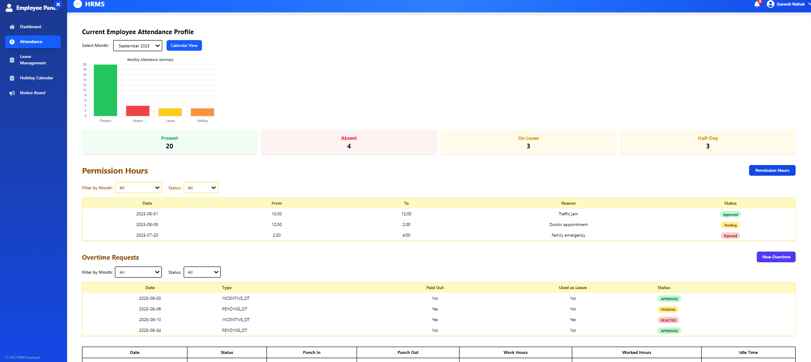
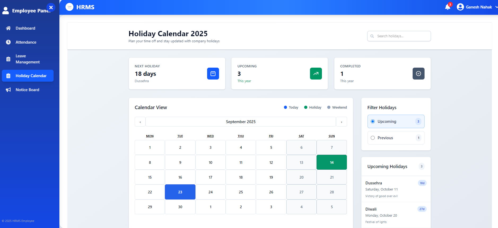
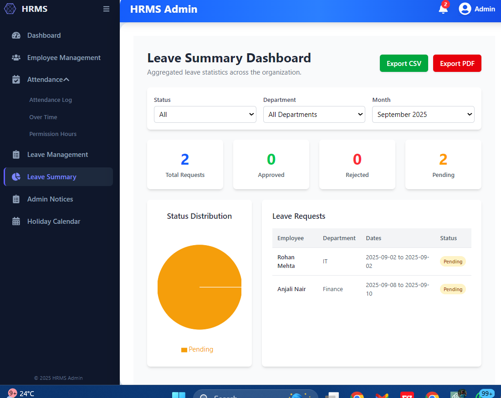
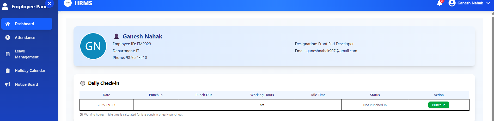
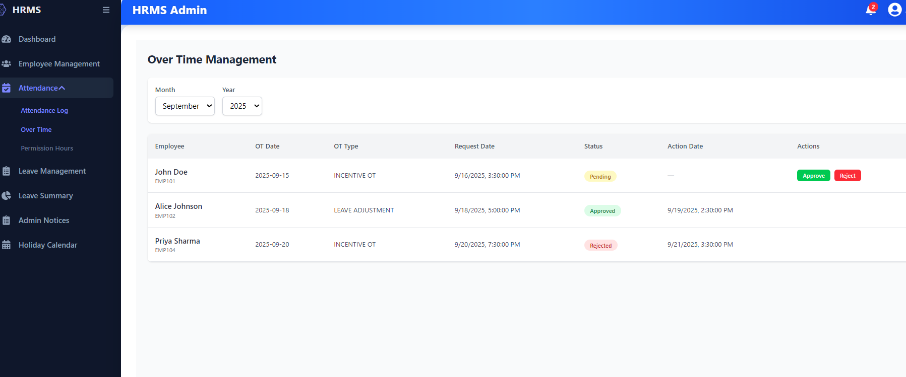

# HRMS (Human Resource Management System) 🏢

A **full-featured HRMS** to manage employees’ attendance, leaves, notices, holidays, and automated email notifications. Enables admins to efficiently manage employee information and employees to stay updated.
(PLEASE REVIEW THE IMAGES ATTACHED AT THE END OF THIS FILE)

---

## Features

### Admin
- Manage employee data.
- Post notices for employees.
- Approve or reject leave requests.
- Add holidays to calendar.
- Automatic email notifications for:
  - New employees
  - Birthdays
  - Leave request approval/rejection

### Employee
- View attendance.
- Request leaves.
- Receive notices from admin.
- View holiday calendar.
- Receive email notifications.

---

## Tech Stack
- **Backend:** Spring Boot (Java)
- **Database:** MySQL
- **Frontend:** React.js
- **Email Notifications:** JavaMail / SMTP
- **IDE / Tools:** Eclipse / Spring Tool Suite (STS), Node.js

---

## Project Structure

myhrms/
├─ backend/ # Spring Boot backend
├─ frontend/ # React frontend
└─ README.md

---

## Setup Instructions

### Backend (Spring Boot)
1. Clone the repo:
---------------------------------
`bash
git clone <your-repo-url>

2.Open the backend folder in Eclipse or STS.
-----------------------------------------------------
3.Update application.properties with your database and SMTP settings:
--------------------------------------------------------------------------
# Database
spring.datasource.url=jdbc:mysql://localhost:3306/hrms_db
spring.datasource.username=root
spring.datasource.password=your_password

# Server
server.port=8181

# Email (SMTP)
spring.mail.host=smtp.gmail.com
spring.mail.port=587
spring.mail.username=your_email@gmail.com
spring.mail.password=your_app_password
spring.mail.properties.mail.smtp.auth=true
spring.mail.properties.mail.smtp.starttls.enable=true

4.Create the database if it does not exist:
-------------------------------------------
CREATE DATABASE hrms_db;

5.Run the backend:
------------------------
Right-click → Run As → Spring Boot App
or

mvn spring-boot:run

Backend API runs at: http://localhost:8181/

Frontend (React.js)
----------------------

1.Navigate to the frontend folder:
----------------------------------------
cd frontend

2.Install dependencies:
----------------------------
npm install

3.Start the frontend:
---------------------------
npm start

Frontend runs at: http://localhost:5173/ (Vite default port)

4.Ensure API URLs in frontend match backend (http://localhost:8181/api/...).
------------------------------------------------------------------------------------
5.Email Notifications Setup
-----------------------------------
Configure SMTP credentials in application.properties (see above).

For Gmail, generate App Password if 2FA is enabled.

Ensure the email service allows sending emails via SMTP.

Important Notes
-----------------------------
Start MySQL before running backend.

Both frontend and backend must run simultaneously.

Node.js v18+ recommended for frontend.

Adjust ports if conflicts exist.

Make sure application.properties matches your local database and email settings.

For any issues with CORS, ensure backend allows requests from frontend port.

Screenshots / Demo
------------------------
**Attendance Page**

**Holiday Calender**

**Leave Summary**

**Punchin of Employee**

**Overtime Details**

